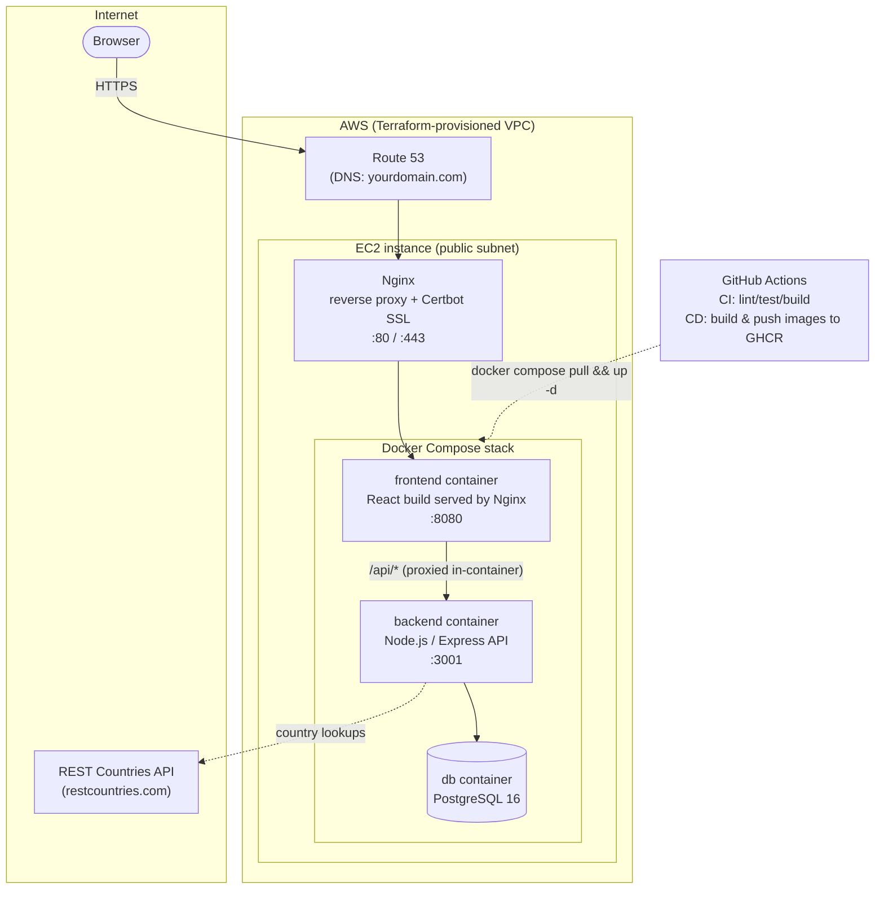

# Dream Vacation Destinations

[](https://github.com/OWNER/REPO/actions/workflows/ci.yml)
[](https://github.com/OWNER/REPO/actions/workflows/cd.yml)
[](LICENSE)

Lets users build a wishlist of countries they'd like to visit. Add a country
name and the app looks it up via the REST Countries API, storing its
capital, population, and region in PostgreSQL alongside your list.

## Project overview

- **Frontend**: React (`frontend/`) - add/remove destinations, view details
- **Backend**: Node.js/Express REST API (`backend/`) - `/api/destinations`
  (GET/POST/DELETE) and `/api/health`
- **Database**: PostgreSQL (official Docker image); schema is created
  automatically on backend startup
- **External API**: [REST Countries](https://restcountries.com/) for
  capital/population/region lookups
- **Containerization**: per-service Dockerfiles + `docker-compose.yml` for
  one-command local startup
- **CI/CD**: GitHub Actions - lint/test/build on every PR, build & push
  Docker images to GHCR on merge to `main`
- **Infrastructure**: Terraform provisions the AWS VPC, subnets, security
  groups, EC2 host, and Route 53 DNS
- **Production**: Nginx reverse proxy + Let's Encrypt (Certbot) SSL in front
  of the Dockerized app on EC2

## Architecture



See `docs/deployment-guide.md` for the full flow in prose.

## Repository layout

```
.
├── backend/              # Express API + Dockerfile
├── frontend/              # React app + Dockerfile
├── docker-compose.yml      # Local/one-command full-stack startup
├── scripts/                # setup-env.sh, backup-db.sh, rotate-logs.sh, deploy.sh, install-cron.sh
├── .github/workflows/      # ci.yml, cd.yml
├── terraform/               # VPC, subnets, security groups, EC2, Route 53, remote state
├── nginx/                   # Host-level reverse proxy config (production, pre-Certbot)
└── docs/                    # git-workflow, domain-dns, deployment-guide, monitoring guides
```

## Local setup (Docker Compose)

Prerequisites: Docker + Docker Compose plugin (or run
`sudo ./scripts/setup-env.sh` on a fresh Ubuntu machine).

```bash
git clone https://github.com/OWNER/REPO.git
cd REPO
cp .env.example .env
docker compose up -d --build
```

- Frontend: http://localhost:8080
- Backend health check: http://localhost:3001/api/health
- Backend API: http://localhost:3001/api/destinations

`docker compose down -v` stops everything and wipes the database volume.

## Running services individually (without Compose)

```bash
# Backend
cd backend && npm install && npm run dev

# Frontend
cd frontend && npm install && npm start
```

You'll need a local PostgreSQL instance and a matching `DATABASE_URL` in
`backend/.env` (copy from `backend/.env.example`) if not using Compose.

## Tests and linting

```bash
cd backend && npm install && npm run lint && npm test
cd frontend && npm install && npm run lint && npm test
```

These are exactly the checks the `CI` GitHub Actions workflow runs on every
pull request into `develop`, `staging`, or `main`.

## Documentation

| Guide | Covers |
|---|---|
| [`docs/git-workflow.md`](docs/git-workflow.md) | Branching model (`main`/`staging`/`develop`), PR flow, branch protection |
| [`docs/domain-dns-guide.md`](docs/domain-dns-guide.md) | Registering a domain and wiring up Route 53 |
| [`docs/deployment-guide.md`](docs/deployment-guide.md) | Terraform → EC2 → Docker Compose → Nginx → Certbot, end to end |
| [`docs/monitoring-cloudwatch.md`](docs/monitoring-cloudwatch.md) | Stretch goal: CloudWatch logs/metrics |
| [`CHANGELOG.md`](CHANGELOG.md) | Everything changed from the original app scaffold, and why |

## Live demo

- App: `http://100.61.74.12`

- Repo: `https://github.com/whixxy23/Dream-Vacation-Capstone`

## License

MIT - see [`LICENSE`](LICENSE).
